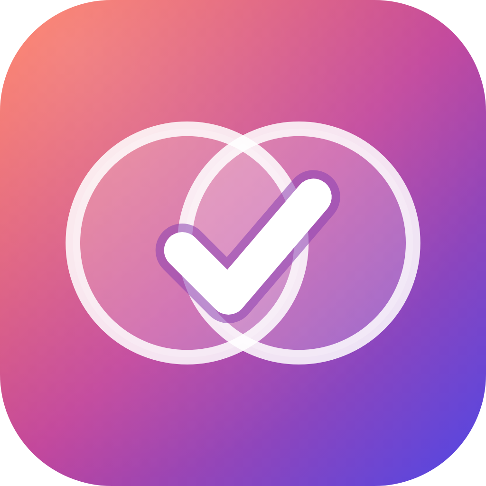

  

<h1 align="center">TwoLives</h1>

A private to-do app for your <b>personal</b> and <b>professional</b> life, synced across your phones and locked with your fingerprint, face, PIN or password.

## Download

**[⬇ Get TwoLives](https://samspei0l.github.io/twolives-releases/)** (Android 7.0 or newer). Or grab the APK from [Releases](https://github.com/samspei0l/twolives-releases/releases/latest).

1. On your Android phone, open the link above and tap **TwoLives-vX.Y.Z.apk**.
2. Open the downloaded file. If Android asks, allow your browser to *install unknown apps*.
3. Open **TwoLives**, sign in with Google or email, and choose a PIN or password.

TwoLives checks for new versions itself, shows what changed and installs the update in a tap. You can also check from **Settings → Check for updates**.

### Is it safe to install?

TwoLives isn't on the Play Store yet, so Android warns about apps from "unknown sources". Every version is signed with the same TwoLives key, which means updates install over the top and keep your data. **Don't uninstall the app before updating.**

Signing certificate SHA-256:
`7A:AB:31:AF:28:C7:66:5B:A4:4E:C8:2C:B5:7B:90:59:8A:2A:6F:EA:7D:8F:AB:12:01:5A:BF:FD:C2:44:28:86`
